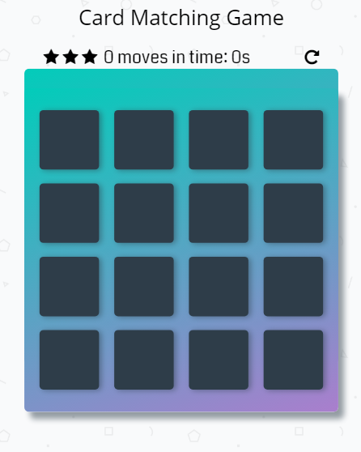
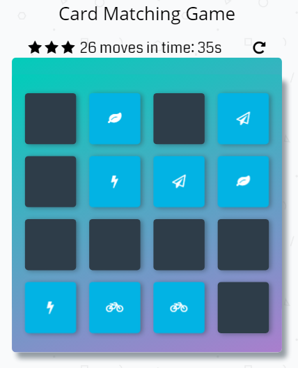

# Memory Game Project

**see the live page at this github pages link:** 
https://adamraz.github.io/fend-project-memory-game/

## Game description
Match the cards!

Try and find all 8 matching cards in the shortest possible time.

You start with 3 stars but as you make more moves you're star rating will eventually decrease.

Just click on a blacked-out (hidden) card block to start the game.

## Credits
This game is based off of the Udacity starter project found here:
https://github.com/udacity/fend-project-memory-game

see app.js script file for code resources used

## project preview:

app screens:

